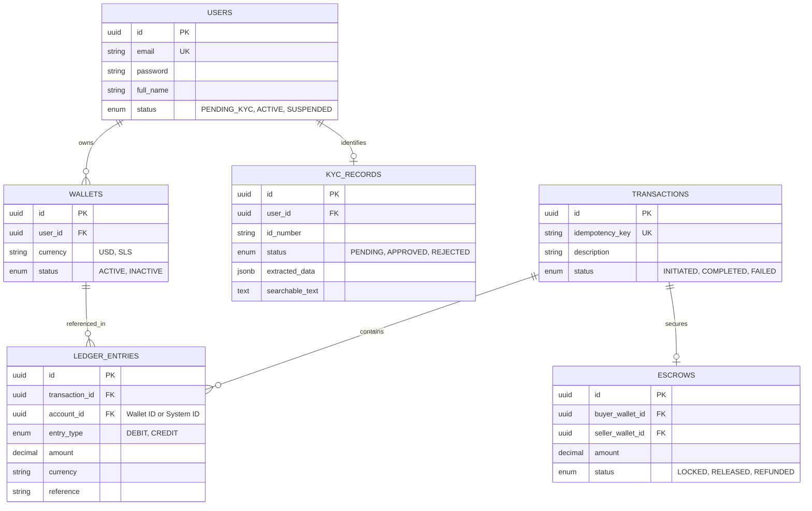

# Gencom Pay Database Schema

## 🏗️ Entity Relationship Diagram

## 💰 Ledger Integrity
The system implements **Double-Entry Accounting**. 
- Every financial event creates at least two `LEDGER_ENTRIES` sharing the same `TRANSACTION_ID`.
- The sum of `DEBIT` and `CREDIT` for any given `TRANSACTION_ID` must result in a net balance of zero.
- **Account Balances** are recomputed on-the-fly:
  `Balance = SUM(Credits) - SUM(Debits)`

## 🔐 System Accounts
Standardized UUIDs for system-level accounting:
- `00000000-0000-0000-0000-000000000001`: System Escrow Account
- `00000000-0000-0000-0000-000000000002`: System Cash Account (Liquidity)
